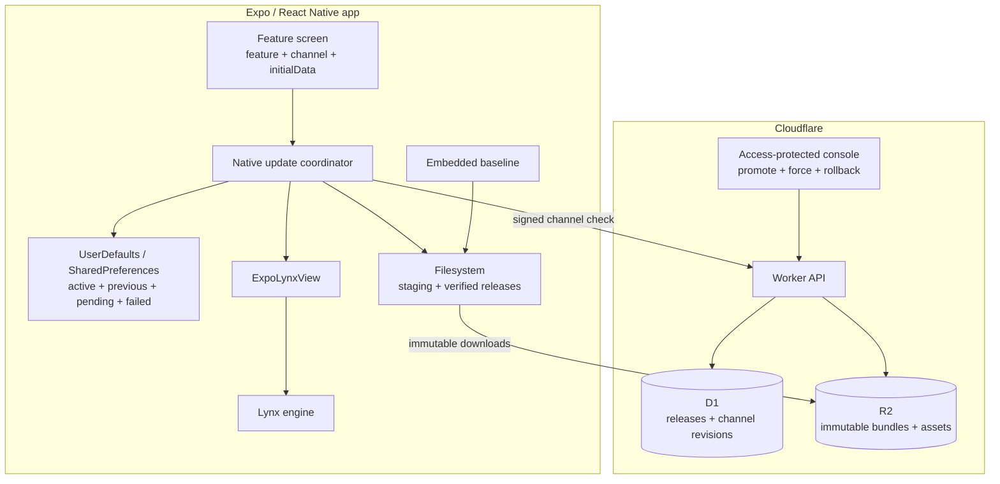

# Architecture

## Goal

Embed Lynx as replaceable UI inside an Expo/React Native host while keeping production bundle delivery safe, offline-capable, and reversible.

## System



## Ownership

| Component | Owns |
|---|---|
| React Native | Placement, feature/channel choice, durable workflow state, `initialData` |
| Native coordinator | Update decision, activation, recovery, events |
| Native state store | Active, previous LKG, pending, attempting, failed IDs |
| Native bundle store | Staging, verification, atomic promote, pruning |
| `ExpoLynxView` | Layout and rendering verified local URLs |
| Worker + D1 | Mutable signed channel revision and audit history |
| R2 | Immutable release manifest, bundle, and sidecar assets |

React Native never supplies an executable production URL. The CDN is not trusted without native verification.

## App-launch flow

```mermaid
sequenceDiagram
  autonumber
  participant App as RN App
  participant C as Native Coordinator
  participant S as Local Store
  participant V as LynxView
  participant W as Worker
  participant R as R2

  App->>C: mount managed source
  C->>S: recover unconfirmed candidate
  C->>S: resolve active cache, else embedded
  C->>V: render local bundle immediately
  C->>W: GET signed channel pointer

  alt no update / same release / 304
    W-->>C: no change
  else invalid or incompatible
    C-->>App: reject; retain current UI
  else new release
    C->>R: fetch signed release manifest
    C->>C: verify signature + runtimeVersion
    C->>R: download bundle + every asset to staging
    C->>C: verify path + size + SHA-256
    C->>S: atomic promote to ready/releaseId

    alt force or on-launch
      C->>V: render candidate now
      alt page loads before watchdog
        C->>S: confirm candidate as active
      else error or timeout
        C->>S: mark failed + restore previous LKG
        C->>V: render previous LKG or embedded
      end
    else next-open
      C->>S: record pending candidate
    end
  end
```

The channel is checked once per launch. There is no timer, OS background fetch, or mid-session swap.

## Activation modes

### `next-open` — default

```text
Launch N
  render current confirmed bundle
  check channel
  download + verify candidate and assets
  save pendingReleaseId
  keep current UI

Launch N+1
  set attemptingReleaseId before render
  render pending candidate
  onLoad -> candidate becomes active/LKG
  error, timeout, or process death -> roll back
```

### `on-launch`

```text
render current confirmed bundle
check channel
complete download + verification
set attemptingReleaseId
reload LynxView with candidate
onLoad -> candidate becomes active/LKG
failure -> restore previous LKG or embedded
```

### Console `force`

`force=true` changes a verified candidate to current-launch activation. It does not bypass signature, runtime compatibility, SHA-256, crash history, or rollback. If the update cannot safely activate, the current UI remains available.

## Local persistent state

One metadata store is authoritative; do not duplicate the active pointer in a separate text file.

```json
{
  "channel": "stable",
  "lastAcceptedRevision": 42,
  "activeReleaseId": "release-a",
  "previousLkgReleaseId": "release-b",
  "pendingReleaseId": null,
  "attemptingReleaseId": null,
  "failedReleaseIds": ["bad-release"],
  "lastCheckedAt": "2026-08-28T01:20:00Z",
  "lastETag": "..."
}
```

Filesystem:

```text
<Application Support>/ExpoLynx/delivery/
  staging/<uuid>/
  ready/<releaseId>/
    release-envelope.json
    main.lynx.bundle
    static/...

App bundle:
  static.lynx
  static/...
  embedded-release-envelope.json
```

Only one update transaction runs at once. After successful activation, retain active + previous LKG; allow one pending candidate temporarily. Embedded baseline is never deleted.

## Signed contracts

Use a signed envelope so both clients verify the exact bytes instead of depending on JSON key order:

```json
{
  "payload": "base64url(UTF-8 JSON)",
  "keyId": "k_2026_08",
  "signature": "base64url(Ed25519 signature over decoded payload)"
}
```

Channel payload contains:

- `feature`, `channel`
- monotonic `revision`
- target release ID, manifest URL, and manifest SHA-256
- exact `runtimeVersion`
- `activation: next-open | on-launch`
- `force`
- `issuedAt`, `expiresAt`

A rollback creates a higher channel revision pointing to an older immutable release. Clients compare channel revision, not human version numbers, so rollback is accepted while replayed pointers are rejected.

Release payload contains:

- release ID and display version
- exact `runtimeVersion`
- one template file
- every sidecar asset with normalized relative path, immutable URL, byte count, and SHA-256

All files must verify before the staging directory is atomically renamed to `ready/<releaseId>`.

## Cloudflare workflow

```text
CI build
  -> produce production Lynx bundle + assets
  -> POST authenticated release to Worker
  -> Worker verifies hashes and signs manifest
  -> Worker writes immutable objects to R2
  -> Worker appends release metadata to D1

Operator console
  -> promote normally, force, or rollback
  -> Worker creates channel revision N+1
  -> Worker signs and stores the pointer

Device
  -> GET /v1/channels/:feature/:channel
  -> verify with public key embedded in app
  -> download immutable release from R2
```

Private signing keys live only in Worker secrets. D1 stores release/channel metadata and signed pointer bytes, never private key material. The console uses Cloudflare Access instead of custom authentication.

## Result matrix

| Condition | Result |
|---|---|
| First install offline | Embedded baseline renders |
| Confirmed cache offline | Cached active release renders |
| Server says same release | No download |
| New `next-open` release | Stage now; activate next launch |
| New `on-launch` release | Activate after full verification this launch |
| Console force | Same as verified `on-launch` |
| Invalid pointer/manifest signature | Reject; keep current UI |
| Replayed channel revision | Reject; keep current UI |
| Wrong runtime version | Reject before file download |
| File size/hash mismatch | Delete staging; keep current UI |
| Candidate render error/timeout | Mark failed; restore previous LKG |
| Process dies before candidate confirms | Recover next launch and restore LKG |
| Server points to failed immutable ID | Skip to prevent boot loop |
| Server rollback | Accept newer channel revision targeting older release |
| Rollback target cached | Reuse verified local files |
| Channel kill switch (`keep-current`) | Keep current UI and stop new activation |

## Production rules

- Always keep an embedded baseline compatible with the shipped Lynx SDK.
- Keep durable session, navigation, form, and mutation state in React Native or the backend.
- Release builds execute only embedded or verified local files.
- Prefetch all declared assets before activation.
- Public trust keys are embedded in the app; a key fetched from the update server cannot bootstrap trust.
- Failed immutable release IDs stay blocked. Fixes must publish new bytes and therefore a new ID.
- bsdiff, Sparkling, multi-feature routing, cohorts, and background downloads remain deferred until measured need exists.
