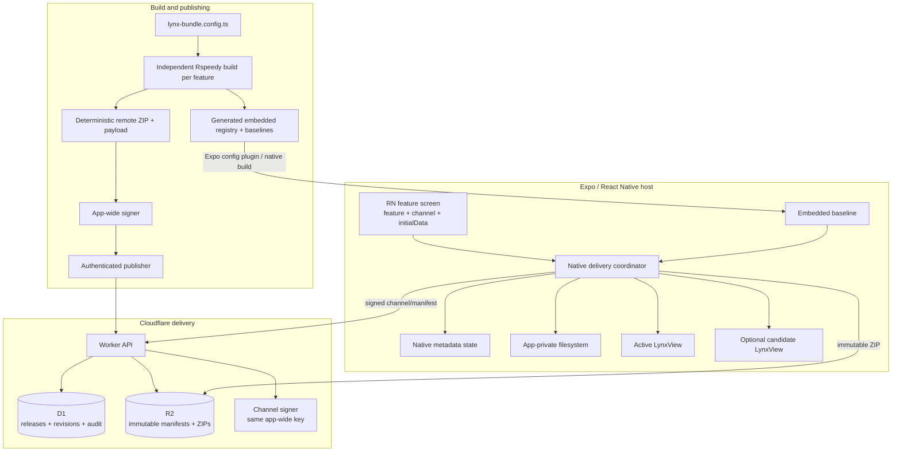

# Remote Lynx bundle architecture

Status: **V2 target architecture and current source of truth**.

The assignable implementation contracts are in [`specs/v2`](./specs/v2/README.md).
When prose here and an assigned V2 spec differ, the more specific assigned spec
controls that PR and this document must be corrected in the same review cycle.

## Goal

Embed many independently released Lynx mini-apps inside an Expo/React Native
host while keeping delivery fast, offline-capable, authenticated, bounded, and
recoverable. This system updates Lynx mini-app packages only. Expo Updates
continues to own React Native host JavaScript and native host releases.

The user-facing rules are:

- Open an embedded or cached mini-app immediately; never wait for an update
  check before showing usable UI.
- Prefetch updates without changing a mounted view.
- Install only authenticated, compatible, complete releases.
- Default activation to the next mini-app open.
- Keep the last-known-good release and embedded baseline available after every
  download, extraction, render, process-death, or low-disk failure.
- Do expensive archive and file verification during installation, not on every
  cached open.
- Adding a new feature or changing its embedded baseline requires a native host
  release; remote delivery may update only an already-declared compatible
  feature.

## System



## Ownership and trust boundary

| Component | Owns | Must not own |
|---|---|---|
| React Native | View placement, feature/channel selection, splash/progress UI, durable product workflow data, `initialData` | Production artifact URLs, public-key selection, trust decisions, filesystem release paths |
| Native coordinator | Channel checks, verification, download, installation, activation, recovery, deduplication, native events | Product session/business state |
| Native state store | Last accepted revision, active, previous LKG, pending, attempting, failed IDs, ETag | Bundle bytes or signing secrets |
| Native bundle store | Transaction staging, completed releases, atomic promotion, pruning | Channel policy or arbitrary external paths |
| `ExpoLynxView` | Rendering a resolved verified local bundle, layout, lifecycle callbacks | Network download and signature policy |
| Build/publisher | Deterministic package, immutable release identity, release signature | Channel activation without operator authorization |
| Worker + D1 | Ready-release catalog, append-only channel revisions, current head, audit | Executable bytes or private keys in database rows |
| R2 | Immutable signed manifest and ZIP bytes | Mutable channel state |

Release builds execute only the embedded baseline or a completed verified local
release. A URL returned by the server is data inside a signed contract; a URL
provided directly by replaceable React Native or Lynx code is never sufficient
authorization to execute bytes.

## Signed protocol

M01 defines the exact wire types and fixtures. Both channel pointers and
release manifests use an envelope:

```ts
type SignedEnvelope = {
  schemaVersion: 1;
  algorithm: 'RSA-SHA256';
  payload: string;   // base64url exact UTF-8 JSON bytes
  signature: string; // base64url signature over decoded payload bytes
};
```

`RSA-SHA256` means RSASSA-PKCS1-v1_5 with SHA-256, not RSA-PSS and not a plain
SHA-256 checksum. V2 uses an RSA modulus of at least 3072 bits and exponent
65537. One native host embeds one app-wide public key and trusts it for every
mini-app in that host's generated embedded registry. The corresponding private
key signs release and channel payloads in restricted environments; it never
enters the application, D1, R2, logs, telemetry, or package output.

Every decoded payload carries signed domain separation:

- release payloads contain `type: 'lynx-release'`;
- channel payloads contain `type: 'lynx-channel'`;
- both contain the exact canonical feature ID requested by the host.

After signature success, the verifier requires the caller's expected document
type and requested feature before using any payload URL, cache path, or state.
There is no user-configured `keyId`, role, or per-feature key list. If logs or
D1 need an identifier, they derive a fingerprint from the embedded SPKI public
key. Rotation ships a new native host trust root before both signing
environments switch; old hosts then retain embedded/LKG content but safely stop
accepting new releases.

### Channel payload

The decoded channel payload includes its `lynx-channel` type, feature, channel,
monotonically increasing revision, release ID, immutable manifest URL/hash,
runtime compatibility, activation, force timing, issue time, and optional
expiry. The revision—not a display version—is the ordering and replay-protection
field.

A rollback creates revision `N + 1` pointing to an older immutable release. It
does not rewrite revision `N` or overwrite the old release.

### Release payload and ZIP

The decoded release payload includes its `lynx-release` type, feature, release
ID, display version, platform, runtime/host compatibility, archive
format/hash/size/expanded limits, and the exact installed file list. Every file
has a normalized relative path, byte size, and SHA-256;
`main.lynx.bundle` appears exactly once.

V2 publishes one deterministic ZIP per platform release:

```text
<featureId>/releases/<releaseId>/manifest.json
<featureId>/releases/<releaseId>/release.zip
```

The ZIP is a package and transport format, not the runtime format. Native code
extracts it to app-private storage and Lynx renders `main.lynx.bundle` from the
completed release directory. ZIP path containment, entry types, CRC, declared
file set, entry count, individual/expanded/archive sizes, path depth/length, and
compression ratio are all fail-closed checks.

The default hard ceilings are defined by M01: 64 MiB archive, 256 MiB expanded,
64 MiB per entry, 4096 entries, compression ratio 100, 512 UTF-8 bytes per path,
and path depth 16. Host builds may lower but not silently raise compiled hard
ceilings.

## Local device storage

Bundle bytes live on the filesystem, not in JSON, `UserDefaults`,
`SharedPreferences`, D1, or SQLite. Every declared feature ships a read-only
baseline in the signed native app; remote releases are overlays, never the
feature's only source.

```text
App bundle / APK assets/
  ExpoLynxEmbedded.bundle/ or expo-lynx/embedded/
    registry.json
    <featureId>/
      baseline.json
      main.lynx.bundle
      static/...

Application Support or app-internal files/ExpoLynx/<featureId>/
  transactions/<transactionId>/
    release.zip.part
    extracted/
  ready/<releaseId>/
    release-envelope.json
    completion.json
    main.lynx.bundle
    assets/...
```

The CLI generates this tree under the consuming app's dedicated
`generated/expo-lynx/embedded` path, not its normal Expo `assets/` directory.
The config plugin validates and copies it into native resources exactly once;
React Native/Metro never imports it. This avoids duplicate packaging, although
the intentional offline baselines still contribute their bytes once to the
IPA/APK.

The `lynx-bundle.config.ts` feature-map key is canonical. `shopping: {}` maps to
the `shopping` directory beside the config, or below the one optional shared
`featuresDir`. There is no per-feature `projectRoot` or repeated `featureId`.
The same key names the source directory, embedded registry entry, RN source,
native cache, server/R2 namespace, and signed payload.

The archive is downloaded and verified in a transaction directory. Extraction
occurs on the same filesystem as `ready`, followed by one-time exact file-set,
size, and SHA-256 verification. Native code writes the completion marker and
atomically renames into `ready/<releaseId>`. A failed or cancelled transaction
cannot change active/pending state and is safe to delete. The staging archive
does not need to remain after a successful installation.

Embedded baselines remain in read-only app resources and are not copied into
the writable cache. CLI generation and prebuild validate their exact file set;
normal opens perform only bounded registry, compatibility, containment, and
required-entry checks, not a complete baseline hash scan.

Release metadata can remain in the small native key-value store plus completion
files while the cache is modest. SQLite is deferred until measurements show a
real need for catalog queries, scale, or transactional metadata beyond the
current state machine.

## Open, prefetch, and install lifecycle

```mermaid
sequenceDiagram
  autonumber
  participant RN as React Native
  participant C as Native coordinator
  participant S as Local store
  participant V as Active LynxView
  participant W as Worker/R2

  RN->>C: open(feature, channel, initialData)
  C->>S: recover attempting/partial transaction
  C->>S: resolve pending attempt, active/LKG, then exact feature baseline
  C->>V: render first usable local release
  C-->>RN: onStart(source, releaseId)
  C->>W: revalidate signed channel

  alt unchanged / 304 / offline
    C-->>RN: update check finished; current UI remains
  else invalid / incompatible / replayed
    C-->>RN: update error; current UI remains
  else new release
    C->>W: fetch signed manifest + immutable ZIP
    C->>S: verify, extract, verify files once, atomic promote
    C-->>RN: progress + installed release
  end

  V-->>C: Lynx load success or failure
  C-->>RN: onLoad or onError
```

React Native may call `prefetchLynxBundle({ feature, channel })` before opening a
mini-app. The same native coordinator performs channel resolution and install;
React Native does not pass the artifact URL. Requests for the same feature and
release deduplicate across open and prefetch callers.

Network, hashing, ZIP inspection, extraction, and file I/O run off the main/UI
and React Native JS threads. LynxView/View mutations and event delivery return
to the platform UI thread. Progress is phase-based and rate-limited so it does
not flood the bridge.

Every visible loading state must reach one terminal outcome: loaded candidate,
loaded active/LKG/embedded fallback, or explicit error. A timeout must never
leave “Loading Mini app” indefinitely.

## Cached-open fast path

An installed release already passed signature, archive, and extracted-file
verification. A normal cached open checks only bounded metadata:

- completion marker exists and matches release/manifest identity;
- runtime and host compatibility still match;
- required entry bundle path exists within the completed release;
- release is not blocked/failed and state points to that completed directory.

It does **not** download the archive or rehash the archive, bundle, and all
resources. Full verification happens again only when installing different
release bytes, recovering a suspicious/incomplete directory, or running an
explicit diagnostic repair.

The same rule applies to embedded resources: build/prebuild already validated
them and native package signing authenticates them, so each open does not hash
all baseline files again.

## Activation and view replacement

### `next-open` — default

Prefetch and install the candidate now, record `pendingReleaseId`, and keep the
current UI untouched. On the next mini-app open, write `attemptingReleaseId`
before rendering the candidate. Confirm it as active/LKG only after Lynx reports
successful load/health. Error, timeout, or process death restores the prior LKG
or embedded baseline.

### `on-launch` — optional candidate path

Do not reload or blank the mounted active view. Keep it visible while preparing
a separate candidate LynxView. Swap only after the candidate reaches the agreed
load/health signal; otherwise destroy the candidate and retain active UI. If a
second view exceeds measured memory limits, disable `on-launch` and defer to
`next-open` rather than weakening recovery.

`force=true` selects safe current-open consideration at an open boundary. It
does not bypass signatures, compatibility, archive/file checks, failed-release
blocking, candidate health, or rollback. The API cannot order destruction of a
currently interactive view.

Host React Native owns the container and safe-area geometry. Active/candidate
replacement must preserve identical bounds and avoid a visible safe-area jump.

## Durable activation state

One native metadata store is authoritative per feature/channel:

```json
{
  "lastAcceptedRevision": 42,
  "activeReleaseId": "release-a",
  "previousLkgReleaseId": "release-b",
  "pendingReleaseId": "release-c",
  "attemptingReleaseId": null,
  "failedReleaseIds": ["release-bad"],
  "lastETag": "channel-envelope-hash"
}
```

State transitions are serialized. Only a completely installed directory can
become pending or attempting. Write `attemptingReleaseId` before rendering; a
later successful load atomically advances active/previous and clears pending.
An unconfirmed attempting release found after process restart is treated as a
failed attempt and rolls back. Failed immutable IDs are not retried in a boot
loop; fixes require a new release ID.

## Cache and disk policy

Cache decisions never evict embedded, active, attempting, pending, or previous
LKG content. The iOS cache slice (M05) starts with soft defaults of 250 MiB and three completed
releases per feature, configurable downward and verified with measurements.

Before extraction, require space for the archive, declared expanded bytes, and
a safety margin. Prune unprotected least-recently-used releases before failing
with a bounded low-disk error. Process startup removes stale transaction
directories and invalid incomplete `ready` directories without scanning and
rehashing every healthy release.

## Cloudflare publication and channel lifecycle

```text
build configured mini-app from its canonical key-derived directory
  -> deterministic ZIP + exact release payload
  -> sign `lynx-release` payload with the app-wide key in restricted CI/signer
  -> authenticated upload to Worker
  -> Worker verifies signature, contract, hash, and size
  -> write immutable manifest + ZIP to R2
  -> read R2 bytes/metadata back and confirm hash
  -> mark D1 release ready
  -> authenticated promote/force/rollback operation
  -> sign `lynx-channel` revision N+1 with the same app-wide key and atomically
     advance head
```

D1 contains immutable release metadata, append-only channel revisions, channel
heads, and redacted audit events. R2 contains immutable manifest/ZIP bytes.
Private keys and bearer credentials are stored only in appropriate secret
systems. A release is not public or promotable until read-back verification
succeeds.

Device-facing endpoints are equivalent to:

```text
GET /v1/channels/:featureId/:channel
GET /v1/releases/:releaseId/manifest.json
GET /v1/releases/:releaseId/release.zip
```

Channel responses use a short revalidation policy, strong ETag, and `304`.
Release manifests and ZIPs use release-scoped immutable URLs, strong ETags, and
long-lived immutable caching. Uploading/rejected/temporary objects are never
served publicly.

## Local static-server testing

The local server uses the same packager, envelope, development signer, ZIP,
route shape, and cache headers as Cloudflare. A physical phone uses the
development computer's LAN IP, not `localhost`.

Cleartext/local-host execution and the test public key are permitted only in an
explicit internal build configuration such as `LYNX_ALLOW_LOCAL_MANAGED_RELEASE`.
Distributable production builds reject that key and local HTTP. Rebuilding a
remote mini-app package does not require Expo prebuild; changing native code,
the embedded trust root, or config-plugin output requires rebuilding the host
and may require prebuild according to the native-project workflow.

The current unpacked local-manifest implementation is a development prototype,
not the target production protocol. S04 keeps it only as a temporary migration
compatibility path while signed ZIP parity lands.

Changing a generated embedded baseline, declared feature set, app-wide public
key, or config-plugin output requires rebuilding the host. Rebuilding and
publishing a compatible remote release for an existing feature does not require
Expo prebuild.

## Android Lynx engine reuse

`LynxViewGroup`/`LynxEngine` reuse is optional performance work after Android
managed delivery and archive installation are correct. Reuse is keyed by
feature, release ID, template identity, and group/global configuration. A new
release always receives a different group/engine; a failed candidate cannot
poison the active release group. The behavior with reuse disabled is the
correctness baseline, and the optimization does not justify an SDK upgrade in
the same PR.

There is no assumed equivalent iOS reuse API in this architecture.

## Failure outcomes

| Failure | Required result |
|---|---|
| Offline first install | Embedded baseline loads |
| Offline cached open | Active completed release loads without full rehash |
| Channel `304` or same release | No archive download or view replacement |
| Wrong configured key, wrong signed type/feature, or invalid signature | Reject; retain current UI |
| Replayed/lower channel revision | Reject unless a newer signed revision deliberately rolls back |
| Runtime/host incompatibility | Reject before archive installation |
| Archive/file hash, CRC, path, type, count, size, or ratio violation | Delete/quarantine transaction; retain current UI |
| Interrupted/slow download | Bounded error and clean retry; no partial ready release |
| Low disk | Prune only unprotected cache or fail; retain current/LKG |
| Candidate error/timeout | Keep or restore active LKG/embedded; block failed immutable ID |
| Process death during install | Remove/recover transaction; pointers unchanged |
| Process death while attempting candidate | Roll back on next open |
| Concurrent identical prefetch | One underlying transaction, multiple observers |
| Different bytes under existing release ID | Server conflict; never overwrite |
| R2 write/read inconsistency | Release remains non-ready and non-public |

## Deferred capabilities

- Delta/bsdiff packages.
- Percentage/cohort rollout and per-user targeting.
- Automatic terminated-app background download.
- Runtime channel switching in general production UI.
- SQLite local release catalog before measurements justify it.
- iOS engine reuse without an official supported API.
- Mid-session forced replacement of an interactive Lynx view.
- Using this protocol for the Expo/React Native host bundle.

See [ROADMAP.md](./ROADMAP.md) for the trigger required to add each capability.
