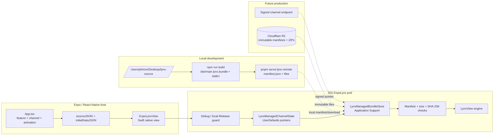
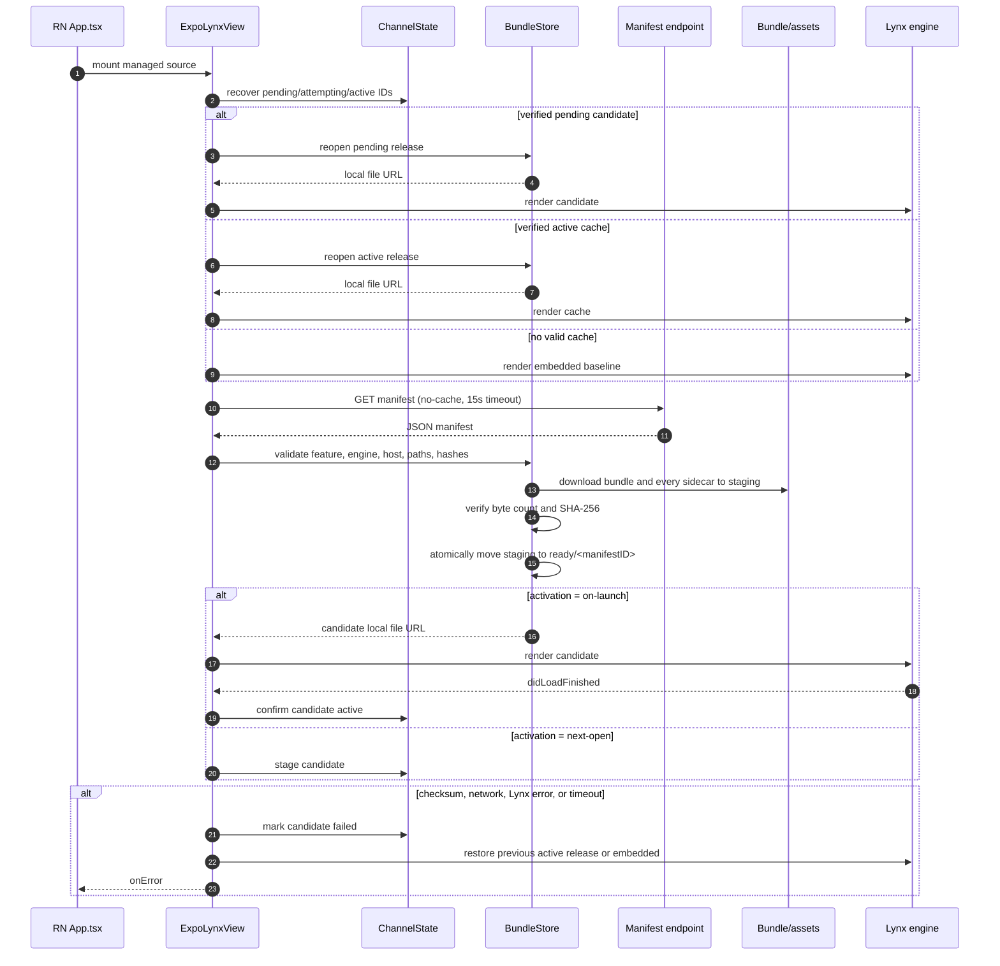
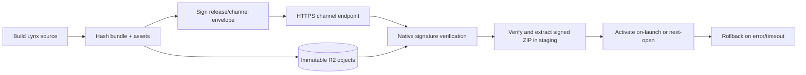

# iOS managed bundle development guide

This document describes the iOS implementation that exists in this repository,
how to test it with a static LAN server, and the work still required before a
production Cloudflare R2 rollout.

This is an implementation-state guide, not the target production contract. Use
[ARCHITECTURE.md](./ARCHITECTURE.md) and [`specs/v2`](./specs/v2/README.md) for
new implementation decisions. The unpacked unsigned manifest flow below is
retained only so the current prototype can be tested while V2 lands.

## Scope and current status

The current slice supports one managed feature per `ExpoLynxView` on iOS. A
React Native screen selects the feature, channel, activation mode, and (for
local testing) a manifest URL. Native code owns the download, validation,
filesystem, activation, rollback, and Lynx lifecycle callbacks.

The local test manifest is intentionally unsigned (`"signature": ""`). Debug
builds accept it. An internal Release build can opt in with
`LYNX_ALLOW_LOCAL_MANAGED_RELEASE`; normal Release builds reject it and use the
embedded bundle. This flag is a testing escape hatch, not a production trust
mechanism.

## Development architecture



The local server copies the sibling Lynx build into the repository's ignored
`.local-lynx-server/` directory. The server must be started with
`--dist ../lynx-source/dist`; `pnpm serve:lynx-local` serves the embedded
baseline and is not a remote-update test.

## Download and activation flow



### Filesystem and state

Each feature has independent release directories:

```text
<Application Support>/ExpoLynx/<feature>/
  staging/<uuid>/                 # incomplete transaction; deleted on exit
  ready/<manifestID>/
    manifest.json
    main.lynx.bundle
    static/...
```

`LynxManagedChannelState` stores the pointers in `UserDefaults`:

```text
activeManifestID       confirmed last-known-good release
previousManifestID     rollback target during an attempt
pendingManifestID      next-open candidate
attemptingManifestID   candidate currently being rendered
failedManifestIDs      candidates not to retry in a boot loop
```

`LynxManagedBundleStore` is an actor, so one feature's install transaction is
serialized. A release is not visible in `ready/` until all declared files have
been downloaded and verified.

## Testing workflow

### 1. Build the remote Lynx source

```sh
cd /Users/phirom/Desktop/lynx-source
npm run build
```

Or use the repository helper, which builds the sibling project and refreshes
the local release directory:

```sh
cd /Users/phirom/Desktop/expo-lynx-monorepo
pnpm rebuild:lynx-remote
```

### 2. Start the correct static server

Keep this process running:

```sh
cd /Users/phirom/Desktop/expo-lynx-monorepo
pnpm serve:lynx-remote
```

The server prints the device URL. With the current Mac address it is:

```text
http://192.168.18.144:3000/manifest.json
```

Verify from the Mac:

```sh
curl http://192.168.18.144:3000/manifest.json
```

Verify from the physical iPhone by opening the same URL in Safari. The Mac and
iPhone must be on the same Wi-Fi network. If Safari cannot open the URL, the
Expo/Lynx code cannot reach the server either; check the Mac firewall, VPN, and
the current LAN address.

Do not use `pnpm serve:lynx-local` for this test. That command serves
`apps/expo-lynx-example/assets/static.lynx`, not the sibling remote build.

### 3. Debug build test (recommended during development)

```sh
cd /Users/phirom/Desktop/expo-lynx-monorepo
pnpm start -- --dev-client --lan
pnpm ios -- --device
```

The example starts in `Managed cache` mode. Force-quit and reopen the app after
changing the server release. The expected successful event is:

```text
Loaded <version> from download (<duration> ms)
```

Use `Direct dev` as a network diagnostic. It bypasses the manifest/cache flow
and requests `main.lynx.bundle` directly. If Direct dev works but Managed cache
does not, investigate manifest validation, staging, or channel state. If both
fail, investigate the phone-to-Mac network or the installed host binary.

### 4. Internal Release test against the LAN server

The local manifest is unsigned, so normal Release builds intentionally reject
it. For a disposable internal test build, apply the opt-in to the `ExpoLynx`
CocoaPod and build Release:

```sh
cd /Users/phirom/Desktop/expo-lynx-monorepo/apps/expo-lynx-example/ios
LYNX_ALLOW_LOCAL_MANAGED_RELEASE=1 pod install

cd /Users/phirom/Desktop/expo-lynx-monorepo
LYNX_ALLOW_LOCAL_MANAGED_RELEASE=1 \
  pnpm --filter expo-lynx-example exec expo run:ios \
  --configuration Release --device
```

The environment variable is needed when CocoaPods regenerates the Pods project.
Do not use it for a production distribution build. Before shipping, replace
the local URL with the signed HTTPS channel implementation and remove this
opt-in.

### 5. Resetting local state

To test first install, uninstall the app from the phone and install it again.
That clears the app's `Application Support/ExpoLynx` files and its
`UserDefaults` channel pointers. A force-quit is sufficient to test a normal
next-launch activation without clearing state.

## Callback expectations

| Event | Meaning | Typical managed sequence |
|---|---|---|
| `onLoadStart` | Native is about to render a selected source | embedded, cache, or download |
| `onLoad` with `source: embedded` | Embedded baseline rendered | first launch while remote downloads |
| `onLoad` with `source: cache` | Previously verified release rendered | offline/cache hit |
| `onLoad` with `source: download` | Newly downloaded candidate rendered | `on-launch` success |
| `onError` with `stage: manifest` | Manifest JSON, URL, feature, or policy failure | no candidate installed |
| `onError` with `stage: compatibility` | Lynx engine or host version mismatch | release rejected before download |
| `onError` with `stage: checksum` | Byte count or SHA-256 mismatch | staging transaction discarded |
| `onError` with `stage: download` | HTTP, connectivity, or timeout failure | current UI retained |
| `onError` with `stage: lynx` | Lynx render failure or candidate watchdog | previous LKG/embedded restored |

The sample React Native splash deliberately remains visible over an embedded
`onLoad` while a managed first download is in flight. It is hidden on a cache or
download success, and on any delivery/render error.

## Test matrix

Run these manually on a Debug device build, then repeat the relevant cases on
the internal Release build:

| Case | Setup | Expected result |
|---|---|---|
| Fresh install online | No app data; server reachable | Embedded appears, then downloaded release appears |
| Fresh install offline | Stop server before launch | Embedded appears; error is surfaced; no endless download |
| Same manifest twice | Relaunch without changing manifest | Existing release is reused; no duplicate files |
| New `on-launch` release | Rebuild source and refresh server | Candidate renders now and becomes active after `onLoad` |
| New `next-open` release | Use `activation: next-open` | Candidate stages; current UI remains until next launch |
| Bad bundle bytes | Change bundle without updating manifest hash | Checksum error; no `ready/<id>` activation |
| Bad sidecar bytes | Change an image without updating its hash | Checksum error; staging directory is removed |
| Missing sidecar | Remove a declared resource from server | Download/resource error; previous UI remains |
| HTTP 404 | Point manifest or file URL at a missing path | Download error; fallback remains usable |
| Network interruption | Turn Wi-Fi off during install | Bounded error; no partial release becomes active |
| Candidate Lynx failure | Serve a bundle that fails to render | Candidate marked failed; previous LKG/embedded restored |
| Process kill | Kill app during candidate activation | Next launch recovers from `attemptingManifestID` |
| Failed-release retry | Relaunch after candidate failure | Failed manifest ID is skipped; no boot loop |
| Release guard | Build Release without opt-in | Embedded baseline; managed endpoint is rejected |
| Local Release opt-in | Build Release with the flag | LAN manifest is eligible for this internal test |
| Safe area | Rotate/notch device during load and after load | Host and Lynx viewport remain aligned; no visible jump |

## Code review findings and production gates

### Implemented safeguards

- Manifest feature, engine version, host minimum version, URL scheme, path,
  size, and SHA-256 fields are validated before activation.
- Bundle and sidecar downloads use a staging directory and are atomically
  promoted only after verification.
- A verified release is reopened and reverified before it is used from cache.
- Candidate activation records an attempting ID before rendering and confirms it
  only after Lynx reports `didLoadFinished`.
- Failed candidates are recorded and rolled back to the previous active release
  or embedded baseline.
- Manifest, bundle, and resource requests have a 15-second timeout so a lost
  LAN does not leave the host splash visible forever.
- Safe feature names and relative resource paths prevent filesystem traversal.

### Blocking before production

- `signature` is parsed but not cryptographically verified. The local manifest
  can therefore be used only with Debug or the explicit internal Release flag.
  Implement the V2 app-wide RSA-SHA256 verification, signed document-type and
  feature checks, native-gated key rotation, replay protection, and embedded
  public key before production Release delivery.
- The current API accepts `manifestUrl` from React Native. Move production
  channel resolution into the native trust boundary so replaceable UI code
  cannot select an arbitrary executable endpoint.
- There is no cache quota or pruning policy. A multi-mini-app host needs an LRU
  or byte-count cap while retaining the active and previous last-known-good
  releases.
- Native storage/state has no XCTest coverage in this slice. Add fixtures for
  malformed manifests, hash failures, interrupted installs, activation, and
  rollback before relying on the manual matrix alone.
- Redirect/origin policy and signed channel metadata still need to be defined
  for the R2/CDN endpoint. HTTPS and a successful status code are not a
  substitute for verifying the signed release pointer.

## Production transition

The local workflow should be replaced by this sequence:



Cloudflare R2 should contain immutable, release-scoped manifest and ZIP files. The
mutable channel endpoint should publish a signed pointer to one release. The
native client verifies that pointer and the release file hashes before Lynx sees
the bundle. React Native should provide only a feature/channel selection and
durable app data, not an arbitrary production executable URL.
