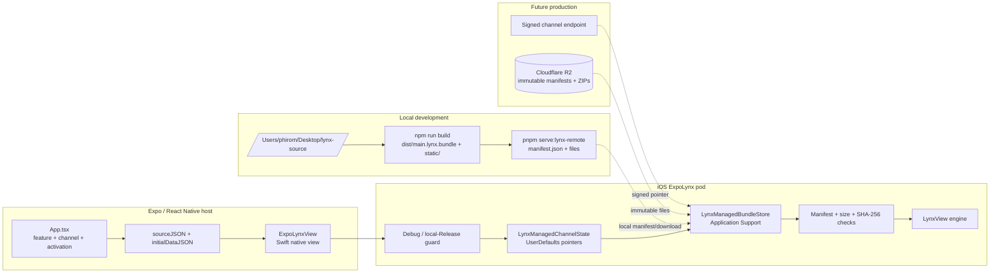
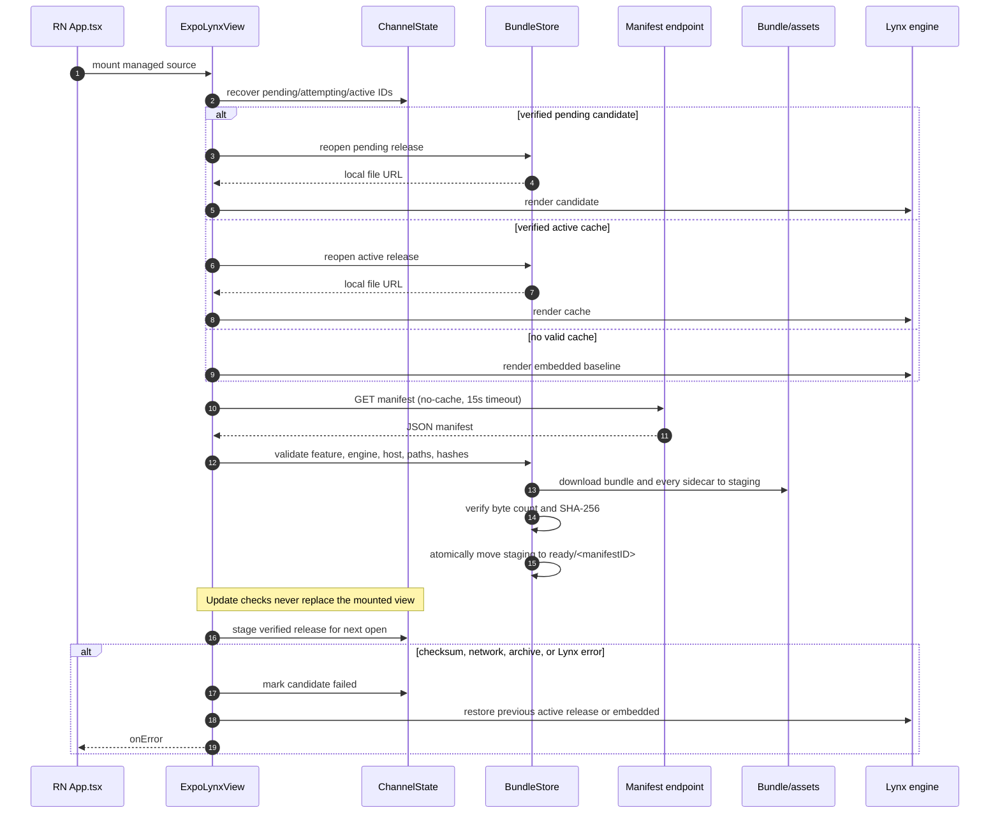
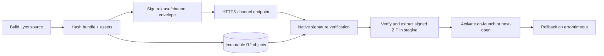

# iOS managed bundle development guide

This document describes the iOS implementation that exists in this repository,
how to test it with a static LAN server, and the work still required before a
production Cloudflare R2 rollout.

This is an implementation-state guide, not the target production contract. Use
[ARCHITECTURE.md](./ARCHITECTURE.md) and [`specs/v2`](./specs/v2/README.md) for
new implementation decisions. V2 uses signed channel and release envelopes
with a verified ZIP; the legacy unpacked manifest route is Debug/local
compatibility only.

## Scope and current status

The current slice supports one managed feature per `ExpoLynxView` on iOS. A
React Native screen selects the feature, channel, activation mode, and, for
local testing, a signed channel URL. Native code owns the download, signature
validation, filesystem, staging, rollback, and Lynx lifecycle callbacks.

`next-open` is the implemented activation behavior. The public `on-launch`
setting is accepted but is deliberately staged as `next-open` until a separate,
measured two-view candidate implementation can retain the active mini-app
through candidate health confirmation. It must not be treated as current-view
replacement.

The local test manifest is intentionally unsigned (`"signature": ""`). Debug
builds accept it. An internal Release build can opt in with
`LYNX_ALLOW_LOCAL_MANAGED_RELEASE`; normal Release builds reject it and use the
embedded bundle. This flag is a testing escape hatch, not a production trust
mechanism.

## Development architecture



The local server copies the sibling Lynx build into the repository's ignored
`.local-lynx-server/` directory. The server must be started with
`--dist ../lynx-source/dist`; `pnpm serve:lynx-local` serves the embedded
baseline and is not a remote-update test.

## Download and activation flow



### Filesystem and state

Each signed V2 feature/channel pair has an independent cache namespace:

```text
<Application Support>/ExpoLynx/<feature>/<channel>/
  staging/<uuid>/                 # incomplete transaction; deleted on exit
  ready/<releaseId>/
    completion.json               # atomic completed-install marker
    release-envelope.json
    main.lynx.bundle
    static/...
```

The first opening after this cache-layout upgrade moves a valid older V2
feature-only directory into the requested channel namespace. This is an
one-time local migration, not a network operation. Legacy unpacked manifests
remain in their former directory only for the Debug compatibility path.

`LynxManagedChannelState` stores the pointers in `UserDefaults`:

```text
activeManifestID       confirmed last-known-good release
previousManifestID     rollback target during an attempt
pendingManifestID      next-open candidate
attemptingManifestID   candidate currently being rendered
failedManifestIDs      candidates not to retry in a boot loop
```

`LynxManagedBundleStore` is an actor, so each feature/channel/release install
transaction is serialized. A release is not visible in `ready/` until every
declared file has been signature, archive, byte-count, and hash verified.
Cached opens read only `completion.json` and confirm the declared paths exist;
they deliberately do not rehash the archive or file contents.

At each managed open the store reconciles the current namespace: abandoned
`staging/` is removed, incomplete ready directories are discarded, and up to
four unprotected ready releases (256 MiB total) are retained. Active,
previous-LKG, pending, and attempting IDs from channel state are protected from
eviction. Installation reserves archive + expanded bytes using the volume's
important-usage capacity before downloading, so an insufficient-space failure
leaves the local embedded/cache fallback usable.

## Testing workflow

### 1. Build the remote Lynx source

```sh
cd /Users/phirom/Desktop/lynx-source
npm run build
```

Or use the repository helper, which builds the sibling project and refreshes
the local release directory:

```sh
cd /Users/phirom/Desktop/expo-lynx-monorepo
pnpm rebuild:lynx-remote
```

### 2. Start the correct static server

Keep this process running:

```sh
cd /Users/phirom/Desktop/expo-lynx-monorepo
pnpm serve:lynx-remote
```

The server prints the device URL. With the current Mac address it is:

```text
http://192.168.18.144:3000/manifest.json
```

Verify from the Mac:

```sh
curl http://192.168.18.144:3000/manifest.json
```

Verify from the physical iPhone by opening the same URL in Safari. The Mac and
iPhone must be on the same Wi-Fi network. If Safari cannot open the URL, the
Expo/Lynx code cannot reach the server either; check the Mac firewall, VPN, and
the current LAN address.

Do not use `pnpm serve:lynx-local` for this test. That command serves
`apps/expo-lynx-example/assets/static.lynx`, not the sibling remote build.

### 3. Debug build test (recommended during development)

```sh
cd /Users/phirom/Desktop/expo-lynx-monorepo
pnpm start -- --dev-client --lan
pnpm ios -- --device
```

The example starts in `Managed cache` mode. Force-quit and reopen the app after
changing the server release. The expected successful event is:

```text
Loaded <version> from download (<duration> ms)
```

Use `Direct dev` as a network diagnostic. It bypasses the manifest/cache flow
and requests `main.lynx.bundle` directly. If Direct dev works but Managed cache
does not, investigate manifest validation, staging, or channel state. If both
fail, investigate the phone-to-Mac network or the installed host binary.

### 4. Internal Release test against the LAN server

The local server signs its channel and release envelopes with the internal test
key. Normal Release builds still intentionally reject its cleartext HTTP URL.
For a disposable internal test build, apply the opt-in to the `ExpoLynx`
CocoaPod and build Release:

```sh
cd /Users/phirom/Desktop/expo-lynx-monorepo/apps/expo-lynx-example/ios
LYNX_ALLOW_LOCAL_MANAGED_RELEASE=1 pod install

cd /Users/phirom/Desktop/expo-lynx-monorepo
LYNX_ALLOW_LOCAL_MANAGED_RELEASE=1 \
  pnpm --filter expo-lynx-example exec expo run:ios \
  --configuration Release --device
```

The environment variable is needed when CocoaPods regenerates the Pods project.
Do not use it for a production distribution build. Before shipping, replace
the local URL with the signed HTTPS channel implementation and remove this
opt-in.

### 5. Resetting local state

To test first install, uninstall the app from the phone and install it again.
That clears the app's `Application Support/ExpoLynx` files and its
`UserDefaults` channel pointers. A force-quit is sufficient to test a normal
next-launch activation without clearing state.

## Callback expectations

| Event                                 | Meaning                                            | Typical managed sequence                         |
| ------------------------------------- | -------------------------------------------------- | ------------------------------------------------ |
| `onLoadStart`                         | Native is about to render selected local content   | embedded or cache                                |
| `onLoad` with `source: embedded`      | Requested feature's embedded baseline rendered     | fresh/offline open while channel check continues |
| `onLoad` with `source: cache`         | Previously verified release rendered               | offline/cache hit                                |
| `onUpdate: checking`                  | Signed-channel revalidation started                | after local content is usable                    |
| `onUpdate: no-update`                 | ETag `304` or known immutable release              | no ZIP request                                   |
| `onUpdate: downloaded`, then `staged` | ZIP was verified and is ready for the next open    | current view remains mounted                     |
| `onUpdate: error`                     | Update failure after usable local content rendered | current UI remains usable                        |
| `onError`                             | No usable source or a Lynx render/delivery error   | terminal visible-content error                   |

The sample React Native splash deliberately remains visible over an embedded
`onLoad` while a managed first download is in flight. It is hidden on a cache or
download success, and on any delivery/render error.

## Test matrix

Run these manually on a Debug device build, then repeat the relevant cases on
the internal Release build:

| Case                    | Setup                                          | Expected result                                          |
| ----------------------- | ---------------------------------------------- | -------------------------------------------------------- |
| Fresh install online    | No app data; server reachable                  | Embedded appears; signed release stages for next open    |
| Fresh install offline   | Stop server before launch                      | Embedded appears; error is surfaced; no endless download |
| Same manifest twice     | Relaunch without changing manifest             | Existing release is reused; no duplicate files           |
| New `on-launch` release | Rebuild source and refresh server              | Stages safely for next open (candidate swap is deferred) |
| New `next-open` release | Use `activation: next-open`                    | Candidate stages; current UI remains until next launch   |
| Bad bundle bytes        | Change bundle without updating manifest hash   | Checksum error; no `ready/<id>` activation               |
| Bad sidecar bytes       | Change an image without updating its hash      | Checksum error; staging directory is removed             |
| Missing sidecar         | Remove a declared resource from server         | Download/resource error; previous UI remains             |
| HTTP 404                | Point manifest or file URL at a missing path   | Download error; fallback remains usable                  |
| Network interruption    | Turn Wi-Fi off during install                  | Bounded error; no partial release becomes active         |
| Pending Lynx failure    | Serve a bundle that fails to render next open  | Pending ID marked failed; previous LKG/embedded restored |
| Process kill            | Kill app during candidate activation           | Next launch recovers from `attemptingManifestID`         |
| Failed-release retry    | Relaunch after candidate failure               | Failed manifest ID is skipped; no boot loop              |
| Release guard           | Build Release without opt-in                   | Embedded baseline; managed endpoint is rejected          |
| Local Release opt-in    | Build Release with the flag                    | LAN manifest is eligible for this internal test          |
| Safe area               | Rotate/notch device during load and after load | Host and Lynx viewport remain aligned; no visible jump   |

### Internal Release evidence record

For the final iOS gate, copy this block into the PR or issue for each device
run. Never include a signed payload, a query string, credentials, private key,
or app-private cache path.

```text
App build / git commit:
Device model / iOS version:
Lynx SDK and runtime version:
Feature + channel:
Channel revision + release ID:
Server origin (no query string):
Scenario from matrix:
Visible terminal outcome (embedded/cache/staged/error):
Update event phases observed:
Result (pass/fail) and redacted failure code:
Screenshot or recording attachment:
```

## Code review findings and production gates

### Implemented safeguards

- One embedded public key verifies the signed channel and release envelopes
  before their URLs or archive metadata are trusted.
- ZIP extraction validates its central directory, paths, entry count/size/CRC,
  and declared hashes before atomic promotion.
- Cache opens read a small completion marker and expected-entry paths only; no
  healthy open repeats RSA, ZIP, or full-file hashing.
- Channel requests use ETag revalidation and do not request a ZIP for `304`,
  known, pending, active, or failed immutable IDs.
- Feature/channel namespaces, disk reservation, protected-ID retention, and
  startup reconciliation preserve a usable embedded/cache fallback.
- Error and update events redact URL credentials/query values and bound message
  size before crossing the React Native boundary.

### Blocking before production

- The physical internal Release matrix is still a required human/device gate.
  Record both configured features, the exact app build, iOS version, channel
  revision/release ID, and no-secret server address for every result.
- `on-launch` currently stages like `next-open`. A two-view candidate swap must
  be designed, memory-profiled, and tested before that activation option can be
  enabled.
- Direct `manifestUrl` exists only for Debug/local compatibility. Production
  configuration should use the signed channel route exclusively.
- Add XCTest fault-injection coverage for low disk, torn writes, eviction
  ordering, and process death before declaring production readiness.
- Define the final HTTPS redirect/origin policy with the Cloudflare endpoint;
  signatures remain mandatory regardless of transport success.

## Production transition

The local workflow should be replaced by this sequence:



Cloudflare R2 should contain immutable, release-scoped manifest and ZIP files. The
mutable channel endpoint should publish a signed pointer to one release. The
native client verifies that pointer and the release file hashes before Lynx sees
the bundle. React Native should provide only a feature/channel selection and
durable app data, not an arbitrary production executable URL.
