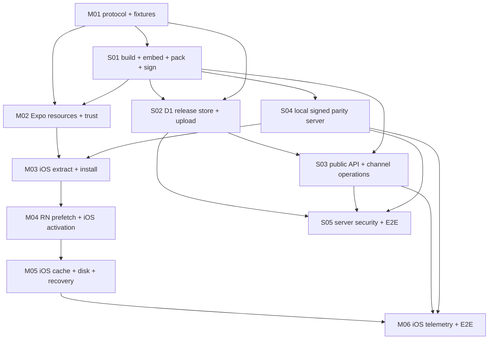

# Remote Lynx bundle V2 consolidated implementation specs

These are the assignable implementation contracts for the
[architecture](../../ARCHITECTURE.md). The [Hot Updater archive review](../../HOT-UPDATER-ARCHIVE-REVIEW.md)
is required context for ZIP/store work.

V2 uses one app-wide RSA-SHA256 trust root, signed document type + feature,
generated per-feature embedded baselines, deterministic remote ZIPs, install-
only expensive verification, last-known-good recovery, and monotonic signed
channel revisions.

## Why the specs are consolidated

The earlier V2 draft separated dependency steps so narrowly that a developer
had to infer handoffs between several PRs. The new work order merges tasks when
they:

- edit the same package/native coordinator/server transaction;
- share one atomic correctness boundary; or
- are not independently useful in production.

Examples: ZIP extraction is part of installation, prefetch produces the state
consumed by activation, and channel reads are the exact output of promotion.

Optional optimization and final E2E gates remain separate. A developer should
be able to read one assigned spec and understand the complete usable result.

## Architecture checkpoint

These decisions are frozen for every implementation slice:

- Every configured feature ships a native embedded baseline; remote delivery is
  an update overlay, not the only source.
- The `lynx-bundle.config.ts` feature-map key is canonical and automatically
  derives its project directory. No repeated `featureId`/per-feature
  `projectRoot`.
- Features build independently; the same validated Rspeedy output feeds the
  expanded embedded tree and deterministic remote ZIP.
- Generated baselines live under dedicated `generated/expo-lynx/embedded`,
  outside Expo normal assets, and the plugin packages them once.
- Expo config exposes one `embeddedBundlesPath` and one app-wide
  `publicKeyPath`; private keys exist only in producer/server secret contexts.
- One RSA key signs release/channel payloads. Signed `type` and `feature`
  provide domain separation.
- Full signature/archive/file verification occurs on installation. Cached and
  embedded opens perform bounded structural checks only.
- RN prefetch cannot replace a mounted view. `next-open` is default;
  `on-launch` requires a separately healthy candidate view.
- Android implementation is deferred to the development roadmap. When it
  resumes, engine reuse is optional and cannot cross feature/release/template
  identity; correctness remains defined with reuse disabled.

Changing a checkpoint decision requires an architecture/spec PR with migration
impact before implementation.

## Agent/PR contract

One implementation agent owns one consolidated spec and normally one PR. The
spec's named phases are internal implementation/commit checkpoints, not separate
contracts. A PR must not implement only an unsafe temporary phase—for example,
an extractor without signed install containment or an Android unsigned managed
path.

The first non-blank PR-body line must be:

```text
Spec: feature/delivery-bundle-update/specs/v2/<mobile|server>/<file>.md
```

The body must contain:

```text
Implementation:
- completed phases and concise summary

Verification:
- exact command and result
- manual device/server result when required

Known limitations:
- none, or explicit remaining limitation permitted by the spec
```

The implementation agent must:

1. Read architecture, this index, and the assigned spec; also read the archive
   review for ZIP/store work.
2. Inspect the dirty worktree and preserve unrelated changes.
3. Implement every in-scope phase and acceptance criterion; do not leave an
   unsigned/unpacked compatibility path usable in production.
4. Add tests for every automatable acceptance criterion and record exact
   verification results.
5. Keep network/hash/ZIP/file work off UI and RN JS threads; mutate native views
   on platform UI threads.
6. Never weaken signing, type/feature binding, containment, limits, atomicity,
   rollback, or Release guards to pass a test.
7. Never commit private keys, credentials, device identifiers, or R2/D1 secrets.

### Copy/paste implementation prompt

```text
Implement <SPEC_PATH> in this repository. Read ARCHITECTURE.md,
specs/v2/README.md, and the assigned consolidated spec before editing; read
HOT-UPDATER-ARCHIVE-REVIEW.md for ZIP/store work. Treat the spec's phases as one
complete correctness boundary, preserve unrelated changes, implement all
in-scope acceptance criteria/tests, and run exact required verification. Do not
deploy, publish production state, rotate production secrets, or weaken a safety
invariant. Prepare the PR body using the Spec, Implementation, Verification, and
Known limitations contract in specs/v2/README.md.
```

Use [PR-REVIEW-CHECKLIST.md](./PR-REVIEW-CHECKLIST.md) after the PR is ready.
Do not assign the final-gate issues M06 or S05 before their dependencies are
complete. Android roadmap items remain unassigned until the iOS/server
milestone is accepted and Android work is explicitly resumed.

## Consolidated dependency graph



M01 starts first. After M01, S01 can run; M02 consumes its embedded/signature
fixtures. S04 local delivery can start from M01/S01 without waiting for the
Cloudflare S02/S03 implementation, so M03/M04 establish iOS first while server
work proceeds in parallel. M05 hardens the iOS cache and recovery path, and M06
is the iOS telemetry/internal Release gate. Android work is preserved in
`DEVELOPMENT-ROADMAP.md` and is not part of this active graph.

## Mobile work order

| Order | Consolidated spec | Complete result |
|---:|---|---|
| M01 | [Shared release protocol](./mobile/m01-shared-release-protocol.md) | Exact typed signed payload/archive contract and fixtures |
| M02 | [Expo resources and trust verification](./mobile/m02-trust-roots-signature-verification.md) | Generated baselines + one public key embedded once; Swift verifies |
| M03 | [iOS ZIP extraction and installation](./mobile/m03-ios-archive-installation.md) | Signed bounded extract, one-time verification, atomic ready store |
| M04 | [RN prefetch and iOS activation/recovery](./mobile/m04-prefetch-activation-recovery.md) | Public API, progress, next-open/candidate activation, rollback |
| M05 | [iOS cache, disk, and recovery](./mobile/m05-ios-cache-disk-recovery.md) | iOS bounded retention and deterministic recovery |
| M06 | [iOS telemetry and E2E](./mobile/m06-ios-telemetry-e2e.md) | iOS internal Release failure matrix and evidence |

## Server/producer work order

| Order | Consolidated spec | Complete result |
|---:|---|---|
| S01 | [Build, embedded, package, and sign CLI](./server/s01-build-package-sign.md) | Friendly config through exact signed deterministic artifact |
| S02 | [Release storage and upload](./server/s02-release-storage-upload.md) | D1 invariants + authenticated immutable R2 publication transaction |
| S03 | [Public API and channel operations](./server/s03-channel-api-operations.md) | Cache-correct reads + atomic promote/force/rollback |
| S04 | [Local signed static parity](./server/s04-local-static-parity.md) | Physical devices test production-equivalent contract over LAN |
| S05 | [Server security and E2E](./server/s05-server-security-e2e.md) | Complete isolated service failure/security/performance gate |

## Merge gates

- S01: two isolated features, atomic/stale-checked embedded tree, deterministic
  ZIP, cross-language signatures, and no private-key leak.
- M02: generated baselines/public key appear exactly once in native resources,
  not Metro; no private key.
- S02: R2 read-back hash succeeds before ready; idempotent/conflict/failure
  transaction tests pass.
- S03: exact stored/returned signed bytes, ETag/304, monotonic concurrent
  promotion, and newer-revision rollback pass.
- M03: malicious archive corpus and interrupted atomic install pass on iOS.
- M04: process-death recovery, terminal splash behavior, and candidate-view
  no-blank/safe-area evidence pass.
- M05: interrupted-state, low-disk, quota, and cache-isolation tests pass on
  iOS.
- M06 and S05 are both required before production-ready status.
